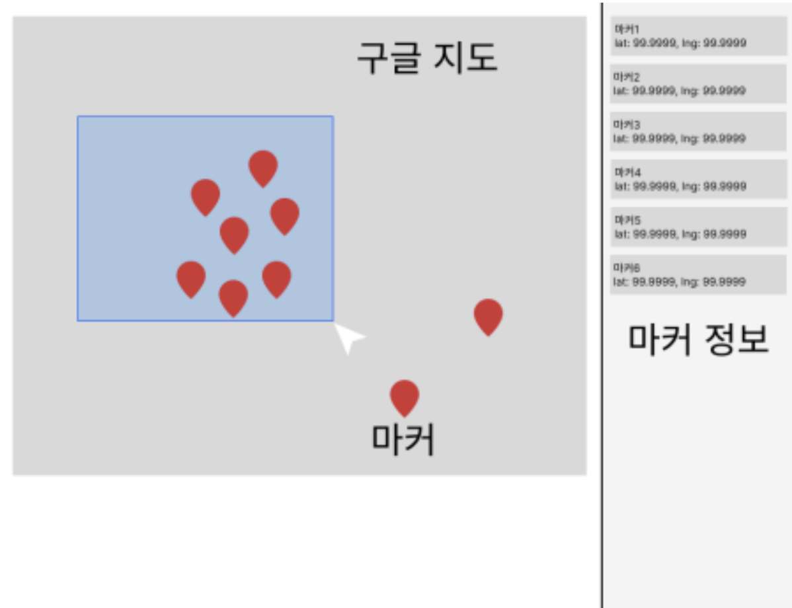

# ⚽️ Pitch View

지도에 K리그 구단들의 경기장을 표시합니다.

## ⚙️ 설치

> 클론 받은 후 의존 패키지를 설치합니다.

```bash
git clone https://github.com/sunaerocket/toylerplate.git
```

```bash
yarn install
```

## 💻 명령어

> 명령어는 설치가 성공하고 난 후에 작동합니다

- 시작: `yarn dev`
- 빌드: `yarn build`
- 프리뷰: `yarn preview`
- 코드검사: `yarn check:code`

## 작업 과정

- 스캐폴더로 초기화

  - 불필요한 구성 요소 제거
  - 어플리케이션 정보 수정
  - README 파일 수정

- 레이아웃 마크업
  - 좌측의 지도 영역과 우측의 장소 목록 영역으로 수평분할

## 점검 사항

- [x] React, TypeScript 사용
- [ ] Google Maps SDK 사용
  - [ ] 지도 고정 처리
  - [ ] 마커 10개 이상
- [ ] 모바일 환경에 대응하는 반응형 코드 작성
- [x] README 파일 작성
- [ ] 작업 내역을 알 수 있도록 커밋 메시지 작성
- [ ] 원격 저장소 링크로 제출

## UI 가이드



## 참고자료

- [Blog, "flex-grow is weird. Or is it?"](https://css-tricks.com/flex-grow-is-weird/)
